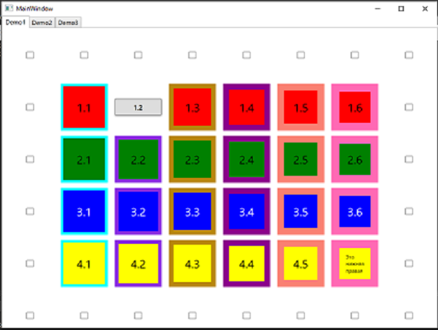
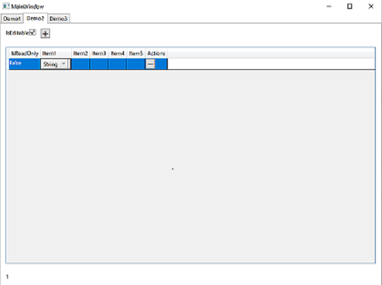
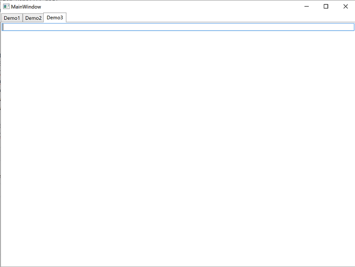
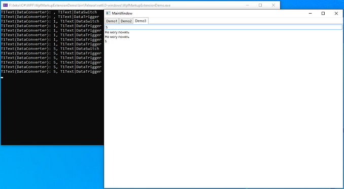

**Attention!** _This article, as well as this announcement, are automatically translated from Russian_.

# Demo
To demonstrate the described extensions, a Demo application has been developed.

You can install it [here](https://leksiqq.github.io/WpfMarkupExtension/download/)

Sources are [here](../tree/master/WpfMarkupExtensionDemo)

### Description
The application consists of one window with three tabs.
#### Demo1 tab

* Buttons located in the same row, column or diagonally between two "checked" "checkboxes" take the form of an ellipse.
* For each "checked" "checkbox", the "checkboxes" that form a row, column or diagonal with it are highlighted in green.
* When you hover over a button, the background of the remaining buttons in the column takes on the background color of the button under the cursor, and the borders of the buttons in the row become the same as the border of the button under the cursor.
* When a button is pressed, the button centrally symmetrical with it flashes.
* The second button in the first row and the last button in the last row have a special style.
#### Demo2 tab

* "checkbox" `IsEditable` determines whether the entire table is editable, that is, whether it is possible to add or delete a row or edit a field if the row itself is marked as editable (first column)
* Each row can itself be marked as editable or not.
* Each cell can take values of types from the list that appears when editing.
* When changing the type of a cell that has a value, it is either converted or disappears if the conversion is not defined.
#### Demo3 tab

If you enter numbers from 1 to 4 in the field, the corresponding numeral in Russian will be displayed in the lines below, obtained in two ways - the usual `<DataTrigger>` and `<DataSwitch>`, if you enter something other than an empty string, the phrase is displayed "I can't understand", also received in both ways.
 

Calls to the `Text` property of the `TextBox` element are displayed on the console peeking out from behind the window through the converter with the appropriate parameters, and it is clear that in the case of `<DataSwitch>` the call occurs once, and in the case of `<DataTrigger>` - number of times equal to the number of options.

**Before:** ([DataSwitch](DataSwitch-en)) **Start:**([Overview](Overview))